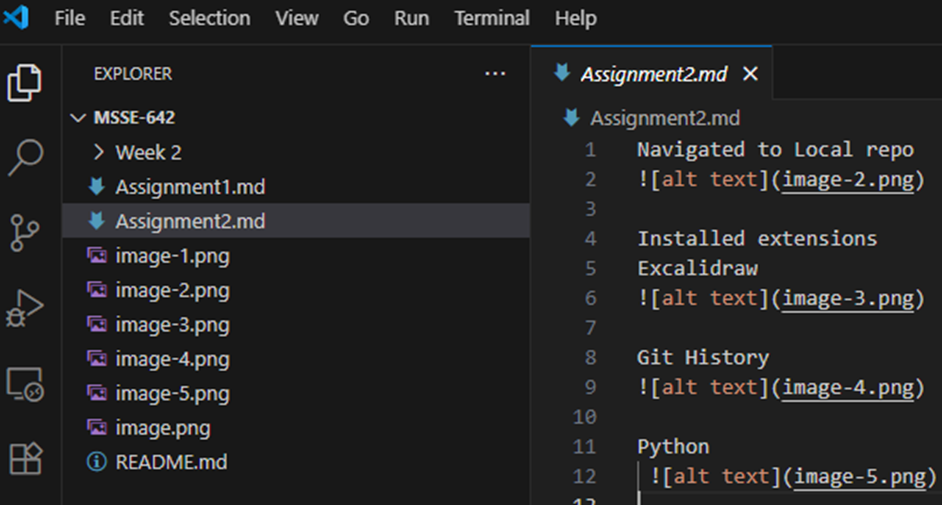
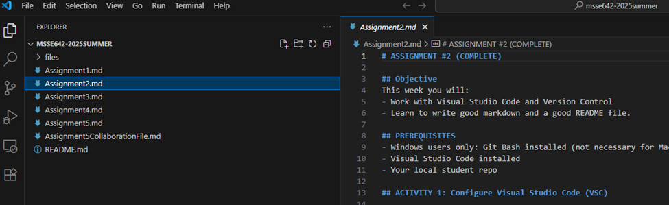

# ACTIVITY 1: Configure Visual Studio Code (VSC)

## Installed Extensions

### Excalidraw  

### Git History  

### Python  

---

# ACTIVITY 2: Clone the Class Repo and Add to Your VSC Workspace

## Student Repo  

## Class Repo  

---

# ACTIVITY 3: Wrote an Appropriate README File

---

# ACTIVITY 4: Advanced Exercises

## Bullshit Article

### As software engineers, how should we distinguish between a system that makes mistakes and one that "bullshits" — generating plausible-sounding but unreliable output? Give a real-world example.

A system that makes mistakes is still oriented toward getting the facts right—it errors despite caring about truth—whereas a system that “bullshits” is indifferent to whether its outputs are true or false and focuses instead on sounding persuasive or accomplishing some other aim. In Frankfurt’s terms, bullshit is “unconnected to a concern with truth,” making it potentially more corrosive than lying because it erodes the very habit of tracking reality.

**Real-world example:**  
An autocomplete-style model that confidently invents a scholarly citation with plausible author names and journal titles. That’s not a simple error like a wrong date in a correct source; it’s fabricated authority crafted to pass as knowledge without any underlying commitment to truth.

---

### When designing or integrating large language models (LLMs), what responsibilities do we have to prevent the spread of 'bullshit'?

When designing or integrating LLMs, our responsibility is to keep the system’s “eye on the facts” rather than the performance of sounding right. Practically, that means defaulting to retrieval-grounded generation, forcing claims to carry sources, scoring and surfacing uncertainty, and enabling abstention (“I don’t know”) when evidence is thin. It also means red-teaming for failure modes that reward fluency over accuracy, calibrating models against truth-oriented benchmarks, gating deployment with human review in high-stakes contexts, and avoiding UX patterns (e.g., overly authoritative tone) that nudge users to treat outputs as unquestionable. In short, we must engineer against the very indifference to truth that defines bullshit.

---

### Can the same tools used to produce misinformation also be engineered to detect or mitigate it — and what design patterns or guardrails might make that possible?

Yes—the same generative tools can also be engineered to detect or mitigate misinformation, provided we embed guardrails that re-introduce accountability to truth. Effective patterns include:

- Retrieval-augmented fact-checking with explicit citations
- Claim decomposition and cross-model consensus checks
- Source-credibility filters
- Refusal policies when verification fails
- Content-provenance signals (e.g., cryptographic signatures) in the pipeline
- Human-in-the-loop escalation for ambiguous cases

These guardrails work precisely because they counter the “phony” posture Frankfurt warns about, replacing plausibility-seeking with evidence-seeking and making it harder for fluent but unconcerned outputs to slip through.