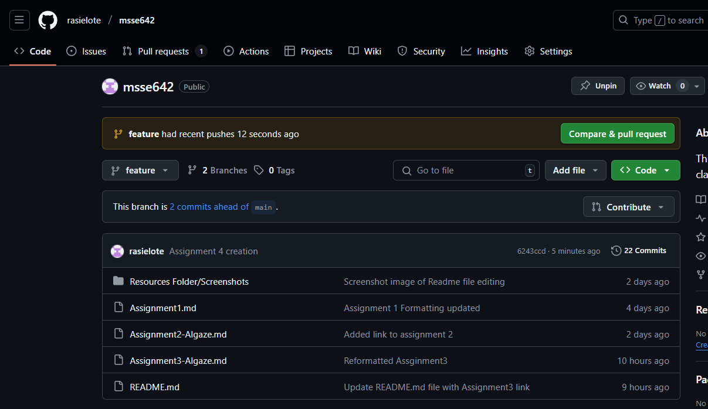

## New "feature" branch created 

## Merge "feature" branch into "main" branch

# Advanced Exercises

## Discuss

### What are some of the AI Assisted Coding tools, e.g. Cursor? Will they replace coding as a skill?

Artificial intelligence (AI) is quickly changing the way software is developed. Tools like **Cursor**, **GitHub Copilot**, and **Amazon CodeWhisperer** use AI to suggest code, detect errors, and even generate whole functions. Much like the way ChatGPT has shown impressive growth in emotional awareness skills (Elyoseph et al., 2023), these coding assistants continue to improve as they are used, making them valuable partners in everyday programming work.

Even with these advances, AI will not fully replace coding as a skill. The emotional-awareness study found that ChatGPT could outperform humans in identifying and describing emotions (Elyoseph et al., 2023), but that does not mean it can actually feel emotions. In the same way, AI can write code but it does not truly understand the larger purpose of a system. Humans are still needed to design software, think critically about trade-offs, and ensure that solutions align with real-world needs.

---

### If learning to code will become less important, what new skills will software engineers need to have?

As AI reduces the need to focus on writing every line of code, the role of software engineers will shift. Skills such as:

- **System design**
- **Security**
- **Testing**
- **Ethical decision-making**

will become more important. Engineers will also need to learn how to work effectively with AI, treating it as a collaborator whose output must be checked and guided. This reflects the study’s insight that AI can simulate emotional understanding (Elyoseph et al., 2023), but humans remain responsible for interpreting, validating, and applying it in meaningful ways.

---

### Many think that software engineers will need to develop people skills more than ever. Will AI outperform people in that area as well?

Many believe that people skills will become more valuable for engineers in the future. The research on ChatGPT showed that AI can sometimes outperform humans in emotional awareness tests (Elyoseph et al., 2023), which suggests it may become a strong tool for communication support. However, true human connection involves trust, shared experiences, and the ability to navigate complex social situations—areas where AI still falls short. This means that **teamwork, leadership, and empathy** will remain essential human strengths that AI cannot fully replace.

---

**In short:**  
While AI-assisted coding tools are transforming the field, they will not erase the need for coding knowledge or human skills. Instead, they will shift the focus of software engineering toward higher-level problem solving and human interaction, where people and AI can work together, each playing to their unique strengths.

---

### References

- Elyoseph, Z., Hadar-Shoval, D., Asraf, K., & Lvovsky, M. (2023). ChatGPT outperforms humans in emotional awareness evaluations. *Frontiers in Psychology, 14*, 1199058. [https://doi.org/10.3389/fpsyg.2023.1199058](https://doi.org/10.3389/fpsyg.2023.1199058)
- Vaithilingam, P., Zhang, T., & Sarkar, A. (2022). Expectations and experiences of AI-assisted code generation: Copilot in the wild. In *Proceedings of the 14th ACM/IEEE International Symposium on Empirical Software Engineering and Measurement* (pp. 1–12). IEEE. [https://doi.org/10.1145/3544902.3546244](https://doi.org/10.1145/3544902.3546244)