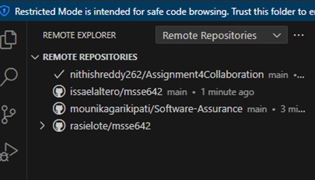
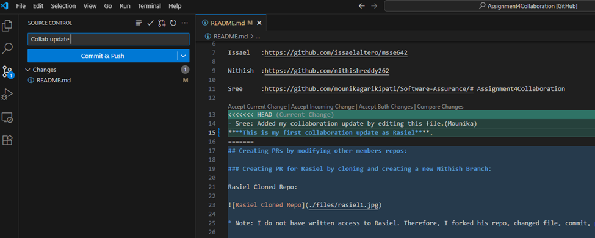

## Team Members
Issael:  https://github.com/issaelaltero/msse642  
Nithish: https://github.com/nithishreddy262  
Sree:    https://github.com/mounikagarikipati/Software-Assurance/  
Rasiel:  https://github.com/rasielote/msse642/

## Cloned and accessed Teammates Repos  

## Created ‘Rasiel' branch. Committed and pushed an update to Nitish’s Repo

## Committed and pushed an update to Issael’s Repo

## Committed and pushed an update to Sree’s Repo

## Created a Pull Request to Issael’s Repo

### No conficts were found

# Advanced Exercises
## Q: How do deepfakes illustrate the limits of verification? Deepfakes often pass casual human inspection — how is this like a test suite with poor coverage? What’s the risk of relying on surface-level evaluation?

Deepfakes demonstrate just how fragile our systems of verification can be. These AI-generated videos and audio recordings often look and sound so real that casual inspection is not enough to spot the fraud. Our normal cues—like facial expressions, tone of voice, or background context—can be convincingly imitated. This shows that traditional ways of checking authenticity have limits, especially when they rely only on what seems visually or audibly believable (Biometric Update, 2025). In other words, the very tools and instincts we use to verify information can be easily manipulated.

This challenge is similar to having a test suite with poor coverage in software engineering. A program might pass all the tests written for it, but if those tests only check basic cases, they miss deeper or unusual flaws. Likewise, people and simple detection tools often focus only on surface-level details of media. A deepfake might have smooth lighting, synced lips, and a natural voice, so it “passes” casual inspection. But just as untested edge cases can break a program, subtle inconsistencies in a deepfake—like unnatural eye movements or distorted audio patterns—remain unnoticed because they are outside the “coverage” of our verification (Layton et al., 2024).

The danger of relying on surface-level evaluation is that it can create a false sense of trust. When something looks right, we may assume it is right, which opens the door to misinformation, scams, and manipulation. In a world where synthetic media is becoming increasingly sophisticated, shallow checks are no longer enough. The risks range from believing fake statements attributed to public figures to security systems being tricked by forged identities. Deepfakes remind us that verification must go deeper, just as good testing must explore more than the obvious cases, or else serious flaws and dangers will inevitably slip through.

## References
Biometric Update. (2025, May 22). Deepfakes are testing the limits of American governance. Biometric Update. https://www.biometricupdate.com/202505/deepfakes-are-testing-the-limits-of-american-governance

Layton, R., Choi, H., & Chandrasekaran, V. (2024). Beyond accuracy: Evaluating deepfake detection robustness. USENIX Security Symposium. https://www.usenix.org/system/files/sec24fall-prepub-1479-layton.pdf