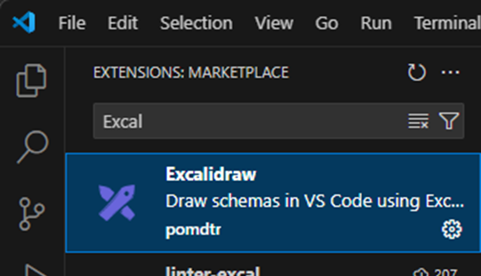
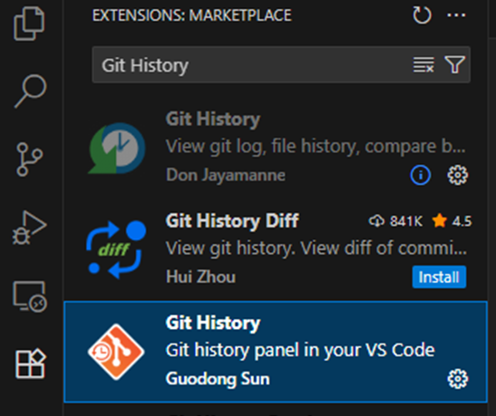
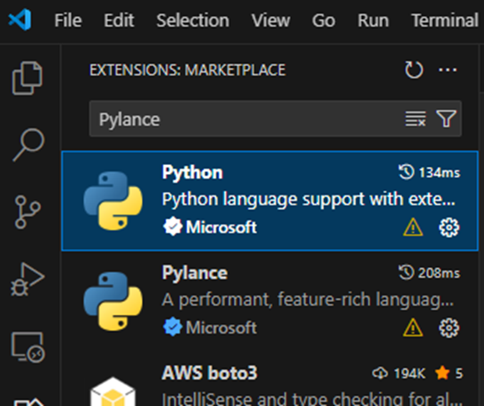
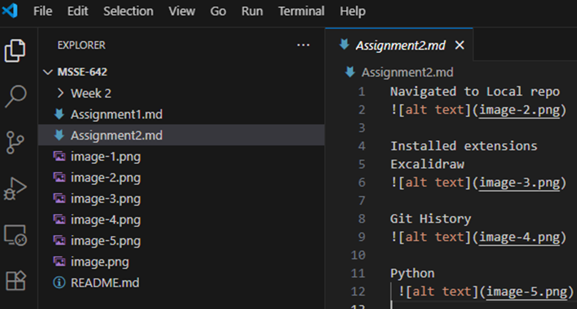
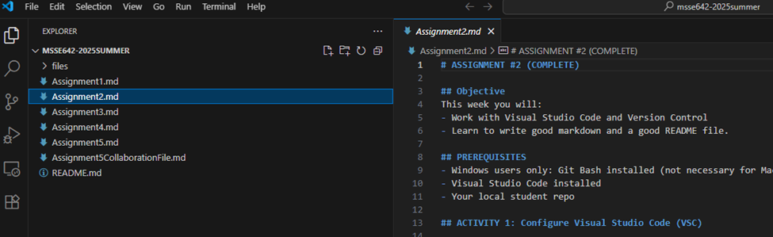

# MSSE-640
## Description
This project is a required repository for Regis University's MSSE-640 class of 2025, including installing essential extensions, cloning repositories, and documenting the process with screenshots.

## Table of Contents
- [Installed Extensions](#installed-extensions)
- [Cloning Repositories](#cloning-repositories)
- [Screenshots](#screenshots)
- [Usage](#usage)
- [Contributing](#contributing)
- [Assignments](#assignments)
- [Contact](#contact)

## Installed Extensions
- **Excalidraw**  
  
- **Git History**  
  
- **Python**  
  

## Cloning Repositories
- **Student Repo**  
  
- **Class Repo**  
  

## Screenshots
All screenshots are located in the `Resources Folder` directory.

## Usage
1. Install Visual Studio Code.
2. Install the listed extensions.
3. Collaborate with classmates

## Contributing
Contributions are welcome! Please fork the repository and submit a pull request.

## Assignments
<a href="https://github.com/rasielote/MSSE-640/blob/main/Assignment1-Algaze.md">Assignment 1 - Algaze</a>  
<a href="https://github.com/rasielote/MSSE-640/blob/main/Assignment2-Algaze.md">Assignment 2 - Algaze</a>  
<a href="https://github.com/rasielote/MSSE-640/blob/main/Assignment3-Algaze.md">Assignment 3 - Algaze</a>  
<a href="https://github.com/rasielote/MSSE-640/blob/main/Assignment4-Algaze.md">Assignment 4 - Algaze</a>  
<a href="https://github.com/rasielote/MSSE-640/blob/main/Assignment5-Algaze.md">Assignment 5 - Algaze</a>  

## Contact
For any questions or suggestions, please contact ralgazeperdomo@regis.edu